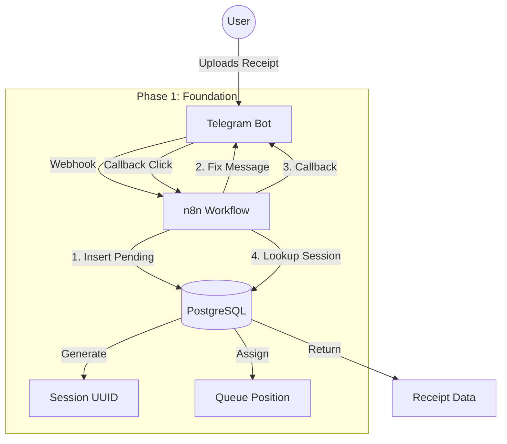

# Phase 1: Architecture Overview

## Data Flow

## Key Components

1.  **Session Tracking**: Every receipt gets a `receipt_session_id` (UUID) upon insertion.
2.  **Queue Management**: `queue_position` is assigned using `get_next_receipt_number()`.
3.  **Optimistic Locking**: `row_version` prevents race conditions during concurrent updates.
4.  **Content Hashing**: `content_hash` stored for future duplicate detection.
